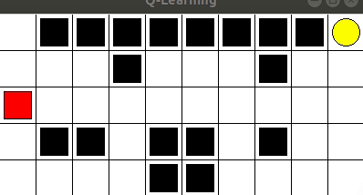

# Q-Learning

Projeto desenvolvido para a disciplina de Inteligência Artificial.
Implementação do algoritmo clássico de IA de aprendizagem por reforço.

<h3>Descrição do Algoritmo</h3>
O Explorador inicia na posição linha = 0 coluna = 0. 
A cada episódio os valores retornam a zero. 
A tabela Q inicia com a lista de ações pré-definidas e com as recompensas zeradas
Para cada episódio, a parada ocorre em caso da ação levar o explorador a algum bloco preto, ou levar o explorador ao objetivo.
A ação é selecionada aleatoriamente em 10% dos casos e em 90 % dos casos é selecionada a ação de maior recompensa.
Quando existe empate, a primeira ação da lista é selecionada.
 

<h3>Simulação</h3>
